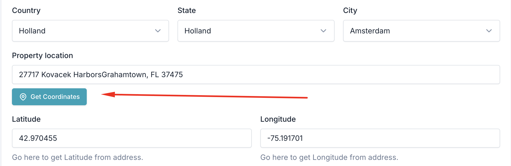
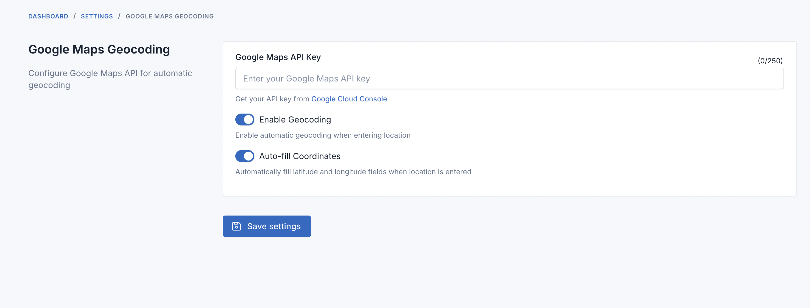

# FOB Google Maps Geocoding Plugin

🗺️ **Enhance your property forms with intelligent address autocomplete and automatic coordinate generation!**

This powerful plugin integrates Google Maps Places API and Geocoding API to provide seamless address input with automatic latitude/longitude population for property forms in Botble CMS.



## ✨ Key Features

### 🎯 **Smart Address Input**
- **Google Places Autocomplete**: Real-time address suggestions as you type
- **Instant Geocoding**: Automatic coordinate population when selecting from dropdown
- **Formatted Addresses**: Clean, standardized address formatting from Google
- **Global Coverage**: Works worldwide with Google's comprehensive location database

### 🎨 **Enhanced User Experience**
- **Beautiful UI**: Custom-styled autocomplete dropdown with hover effects
- **Responsive Design**: Optimized for desktop and mobile devices
- **Dark Mode Support**: Automatically adapts to system color scheme
- **Smooth Animations**: Loading states and hover effects for better UX

### ⚙️ **Flexible Configuration**
- **Admin Settings Panel**: Easy configuration through Botble admin interface
- **Toggle Features**: Enable/disable autocomplete and auto-fill independently
- **API Key Management**: Secure API key storage and configuration
- **Fallback Options**: Manual geocoding button for custom addresses

### 🛡️ **Robust & Reliable**
- **Error Handling**: Graceful handling of API errors and edge cases
- **Fallback Geocoding**: Manual geocoding for addresses not in autocomplete
- **Performance Optimized**: Efficient API usage with smart caching
- **Security**: Proper API key restrictions and domain validation



## 🚀 Installation

### Step 1: Install the Plugin
```bash
# Copy the plugin to your Botble installation
cp -r fob-google-maps-geocoding platform/plugins/

# Activate the plugin
php artisan cms:plugin:activate fob-google-maps-geocoding

# Publish assets (CSS, JS files)
php artisan cms:plugin:assets:publish fob-google-maps-geocoding

# Clear cache
php artisan cache:clear
```

### Step 2: Configure Google Maps API

#### 🔑 **Get Your API Key**
1. Visit [Google Cloud Console](https://console.cloud.google.com/)
2. Create a new project or select an existing one
3. Enable the required APIs:
   - **Geocoding API** (Required)
   - **Places API** (Required for autocomplete)
   - **Maps JavaScript API** (Optional, for enhanced features)

#### 🛡️ **Secure Your API Key**
1. Create credentials (API Key)
2. **Restrict by HTTP referrers** (websites):
   ```
   yourdomain.com/*
   *.yourdomain.com/*
   ```
3. **Restrict by API**: Select only the APIs you enabled above

### Step 3: Plugin Configuration

1. **Navigate to Settings**:
   ```
   Admin Panel → Settings → Others → FOB Google Maps Geocoding
   ```

2. **Configure the Plugin**:
   - ✅ **API Key**: Paste your Google Maps API key
   - ✅ **Enable Geocoding**: Turn on the plugin functionality
   - ✅ **Auto-fill Coordinates**: Enable automatic coordinate population

3. **Save Settings** and you're ready to go!

## 📖 How to Use

### 🏠 **Creating/Editing Properties**

When you're in the property form (Create or Edit):

#### **Method 1: Autocomplete (Recommended)**
1. 🔤 **Start typing** in the "Location" field
2. 📋 **Select from dropdown**: Choose an address from the suggestions
3. ✨ **Auto-population**: Latitude and longitude fill automatically
4. ✅ **Done!** Your property now has precise coordinates

#### **Method 2: Manual Entry**
1. ⌨️ **Type your address** without selecting from dropdown
2. 🎯 **Auto-geocoding**: Coordinates populate when you leave the field (if enabled)
3. 🔘 **Manual button**: Click "Get Coordinates" for on-demand geocoding

### 🎨 **User Interface Features**

#### **Smart Autocomplete Dropdown**
- 🔍 **Real-time suggestions** as you type
- 🌍 **Global coverage** with Google's location database
- 🎯 **Precise results** with formatted addresses
- 🖱️ **Hover effects** for better interaction
- 📱 **Mobile-friendly** responsive design

#### **Enhanced Button Design**
- 📍 **Map pin icon** with proper SVG graphics
- ⏳ **Loading animation** during geocoding
- 🎨 **Smooth hover effects** and transitions
- 🚫 **Disabled state** with visual feedback

#### **Visual Feedback**
- ✅ **Success notifications** when coordinates are found
- ❌ **Error messages** for failed requests
- 🔄 **Loading states** during API calls
- 🌙 **Dark mode support** for better accessibility

## 🔧 Technical Features

### **API Integration**
- **Dual API Support**: Uses both Places API and Geocoding API
- **Smart Fallbacks**: Geocoding API as backup for manual entries
- **Error Handling**: Graceful handling of API limits and errors
- **Performance**: Optimized API calls with debouncing

### **Browser Compatibility**
- ✅ Chrome 60+
- ✅ Firefox 55+
- ✅ Safari 12+
- ✅ Edge 79+
- 📱 Mobile browsers (iOS Safari, Chrome Mobile)

## 📋 Requirements

### **System Requirements**
- 🏗️ **Botble CMS**: Version 7.5.0 or higher
- 🌐 **Internet Connection**: Required for API calls
- 💻 **Modern Browser**: JavaScript ES6+ support

### **Google Cloud Requirements**
- 🔑 **Google Cloud Account**: Free tier available
- 🗺️ **Google Maps API Key** with enabled APIs:
  - **Geocoding API** (Required)
  - **Places API** (Required)
  - **Maps JavaScript API** (Optional)

### **API Quotas & Pricing**
- 📊 **Places API**: $17 per 1,000 requests (first 1,000/month free)
- 📍 **Geocoding API**: $5 per 1,000 requests (first 40,000/month free)
- 💡 **Tip**: Set up billing alerts and quotas in Google Cloud Console

## 🔧 Troubleshooting

### **Common Issues & Solutions**

#### 🚫 **"API request denied" Error**
```
❌ Problem: API key is invalid or restricted
✅ Solution:
   1. Check your API key in Google Cloud Console
   2. Ensure APIs are enabled (Geocoding + Places)
   3. Verify domain restrictions match your site
```

#### 🚫 **"Quota exceeded" Error**
```
❌ Problem: You've hit your API usage limits
✅ Solution:
   1. Check usage in Google Cloud Console
   2. Increase quotas or upgrade billing plan
   3. Implement request caching if needed
```

#### 🚫 **Autocomplete Not Working**
```
❌ Problem: Dropdown doesn't appear when typing
✅ Solution:
   1. Ensure Places API is enabled
   2. Check browser console for JavaScript errors
   3. Verify plugin is activated and assets published
   4. Clear browser cache and try again
```

#### 🚫 **Coordinates Not Populating**
```
❌ Problem: Lat/lng fields remain empty
✅ Solution:
   1. Check if "Auto-fill Coordinates" is enabled
   2. Verify Geocoding API is enabled
   3. Try clicking "Get Coordinates" button manually
   4. Check browser console for errors
```

### **Debug Mode**
Enable debug mode to see detailed error messages:
```javascript
// Add to browser console for debugging
window.GoogleMapsGeocodingConfig.debug = true;
```

## ❓ FAQ

### **General Questions**

**Q: Does this work with other form types besides properties?**
A: Currently optimized for PropertyForm, but can be extended to other forms with minor modifications.

**Q: Can I customize the autocomplete behavior?**
A: Yes! The plugin supports various Google Places API options. Contact support for customization.

**Q: Does it work offline?**
A: No, internet connection is required for Google Maps API calls.

**Q: Is there a rate limit?**
A: Yes, Google Maps APIs have usage quotas. See pricing section above.

### **Technical Questions**

**Q: Can I use my existing Google Maps API key?**
A: Yes, as long as it has Geocoding and Places APIs enabled.

**Q: Does it support multiple languages?**
A: Yes, Google Places API returns results in the user's browser language automatically.

**Q: Can I restrict results to specific countries?**
A: Yes, this can be configured in the Google Places API options.

**Q: Is the plugin GDPR compliant?**
A: The plugin itself doesn't store personal data, but Google's APIs may. Review Google's privacy policy.

## 🤝 Support & Contributing

### **Getting Help**
- 📖 **Documentation**: This README covers most use cases
- 🐛 **Bug Reports**: Open an issue with detailed reproduction steps
- 💡 **Feature Requests**: Suggest improvements via GitHub issues
- 💬 **Community**: Join the Friends of Botble community

### **Contributing**
We welcome contributions! Please see [CONTRIBUTING.md](CONTRIBUTING.md) for guidelines.

### **Development Setup**
```bash
# Clone the repository
git clone https://github.com/friendsofbotble/fob-google-maps-geocoding

# Install in your Botble development environment
cp -r fob-google-maps-geocoding platform/plugins/

# Activate and test
php artisan cms:plugin:activate fob-google-maps-geocoding
```

## 📄 License

This plugin is open-sourced software licensed under the [MIT License](LICENSE).

## 🙏 Credits

- **Developed by**: [Friends of Botble](https://friendsofbotble.com)
- **Built for**: [Botble CMS](https://botble.com)
- **Powered by**: [Google Maps Platform](https://developers.google.com/maps)

---

**Made with ❤️ by the Friends of Botble community**

*If this plugin helps your project, please consider giving it a ⭐ star on GitHub!*
